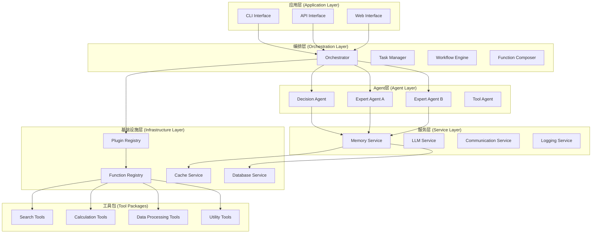

# 🏗️ Multi-Agent Orchestration System Architecture

## 📋 文档概述

本文档定义了多Agent编排系统的完整架构设计，包括系统目标、设计原则、技术架构、实施规划等。后续开发将严格按照本文档执行。

## 🎯 系统目标

### 核心目标

1. **构建可插拔的多Agent编排系统**
2. **实现高内聚低耦合的模块化架构**
3. **支持灵活的Agent协作和任务编排**
4. **提供标准化的函数调用接口**
5. **确保系统的可扩展性和可维护性**

### 业务目标

- 支持复杂的多步骤任务处理
- 实现专业化的Agent分工协作
- 提供统一的工具和服务复用能力
- 支持动态的Agent配置和切换

## 🏛️ 架构设计原则

### 1. 可插拔原则 (Pluggability)

- 每个模块都是独立的、可插拔的组件
- 支持运行时动态加载和卸载
- 模块间通过标准接口通信
- 避免硬编码依赖关系

### 2. 函数优先原则 (Function-First)

- 所有功能都通过纯函数暴露
- 函数无副作用，易于测试和复用
- 支持函数组合和管道操作
- 统一的函数调用接口

### 3. 标准化原则 (Standardization)

- 统一的输入输出格式
- 标准的错误处理机制
- 一致的元数据结构
- 规范的接口定义

### 4. 高内聚低耦合原则 (High Cohesion, Low Coupling)

- 模块内部功能高度相关
- 模块间依赖最小化
- 通过抽象接口解耦
- 支持独立开发和测试

### 5. 可扩展原则 (Extensibility)

- 支持新Agent类型的添加
- 支持新工具函数的注册
- 支持新的记忆策略实现
- 支持新的编排模式

## 🏗️ 系统架构

### 整体架构图



### 分层架构详解

#### 1. 应用层 (Application Layer)

- **职责**: 提供用户交互接口
- **组件**: CLI、API、Web界面
- **特点**: 轻量级，只负责请求转发

#### 2. 编排层 (Orchestration Layer)

- **职责**: 任务编排、流程控制、函数组合
- **组件**: Orchestrator、TaskManager、WorkflowEngine、FunctionComposer
- **特点**: 核心业务逻辑，高度可配置

#### 3. Agent层 (Agent Layer)

- **职责**: 具体的Agent实现
- **组件**: DecisionAgent、ExpertAgents、ToolAgents
- **特点**: 专业化分工，可插拔设计

#### 4. 服务层 (Service Layer)

- **职责**: 提供基础服务
- **组件**: MemoryService、LLMService、CommunicationService
- **特点**: 标准化接口，支持多种实现

#### 5. 基础设施层 (Infrastructure Layer)

- **职责**: 底层支撑服务
- **组件**: PluginRegistry、FunctionRegistry、Cache、Database
- **特点**: 高性能，高可用

## 📁 目录结构设计

```
app/
├── packages/                    # 📦 独立包目录
│   ├── @agent-core/            # 核心接口和类型定义
│   │   ├── interfaces/         # 接口定义
│   │   │   ├── function.interface.ts
│   │   │   ├── plugin.interface.ts
│   │   │   ├── agent.interface.ts
│   │   │   ├── memory.interface.ts
│   │   │   └── registry.interface.ts
│   │   ├── types/              # 类型定义
│   │   │   ├── function.types.ts
│   │   │   ├── plugin.types.ts
│   │   │   ├── agent.types.ts
│   │   │   ├── memory.types.ts
│   │   │   └── common.types.ts
│   │   ├── constants/          # 常量定义
│   │   │   ├── categories.ts
│   │   │   ├── errors.ts
│   │   │   └── events.ts
│   │   └── package.json
│   │
│   ├── @agent-tools/           # 工具函数包
│   │   ├── search/             # 搜索工具
│   │   │   ├── web-search.ts
│   │   │   ├── vector-search.ts
│   │   │   ├── semantic-search.ts
│   │   │   └── index.ts
│   │   ├── calculation/        # 计算工具
│   │   │   ├── calculator.ts
│   │   │   ├── statistics.ts
│   │   │   ├── math-utils.ts
│   │   │   └── index.ts
│   │   ├── data/               # 数据处理工具
│   │   │   ├── json-parser.ts
│   │   │   ├── csv-processor.ts
│   │   │   ├── data-transformer.ts
│   │   │   └── index.ts
│   │   ├── text/               # 文本处理工具
│   │   │   ├── text-analyzer.ts
│   │   │   ├── text-summarizer.ts
│   │   │   ├── text-translator.ts
│   │   │   └── index.ts
│   │   ├── system/             # 系统工具
│   │   │   ├── file-operations.ts
│   │   │   ├── network-utils.ts
│   │   │   ├── datetime.ts
│   │   │   └── index.ts
│   │   └── package.json
│   │
│   ├── @agent-services/        # 服务函数包
│   │   ├── memory/             # 记忆服务
│   │   │   ├── memory-store.ts
│   │   │   ├── memory-query.ts
│   │   │   ├── memory-cleanup.ts
│   │   │   └── index.ts
│   │   ├── llm/                # LLM服务
│   │   │   ├── openai-client.ts
│   │   │   ├── anthropic-client.ts
│   │   │   ├── local-llm-client.ts
│   │   │   └── index.ts
│   │   ├── communication/      # 通信服务
│   │   │   ├── message-bus.ts
│   │   │   ├── event-emitter.ts
│   │   │   ├── pub-sub.ts
│   │   │   └── index.ts
│   │   ├── storage/            # 存储服务
│   │   │   ├── database-client.ts
│   │   │   ├── cache-client.ts
│   │   │   ├── file-storage.ts
│   │   │   └── index.ts
│   │   └── package.json
│   │
│   └── @agent-agents/          # Agent函数包
│       ├── decision/           # 决策Agent
│       │   ├── query-analyzer.ts
│       │   ├── task-planner.ts
│       │   ├── agent-selector.ts
│       │   └── index.ts
│       ├── experts/            # 专家Agent
│       │   ├── code-expert.ts
│       │   ├── data-expert.ts
│       │   ├── business-expert.ts
│       │   ├── research-expert.ts
│       │   └── index.ts
│       ├── tools/              # 工具Agent
│       │   ├── search-agent.ts
│       │   ├── calculation-agent.ts
│       │   ├── file-agent.ts
│       │   └── index.ts
│       └── package.json
│
├── registry/                   # 🔌 注册中心
│   ├── plugin-registry.ts     # 插件注册表
│   ├── function-registry.ts   # 函数注册表
│   ├── agent-registry.ts      # Agent注册表
│   ├── service-registry.ts    # 服务注册表
│   └── index.ts
│
├── orchestrator/               # 🎭 编排器
│   ├── orchestrator.ts        # 主编排器
│   ├── task-manager.ts        # 任务管理器
│   ├── workflow-engine.ts     # 工作流引擎
│   ├── function-composer.ts   # 函数组合器
│   ├── execution-context.ts   # 执行上下文
│   └── index.ts
│
├── memory/                     # 🧠 记忆系统
│   ├── strategies/             # 记忆策略
│   │   ├── centralized-memory.ts
│   │   ├── distributed-memory.ts
│   │   ├── hybrid-memory.ts
│   │   └── index.ts
│   ├── memory-factory.ts      # 记忆工厂
│   ├── memory-service.ts      # 记忆服务
│   └── index.ts
│
├── config/                     # ⚙️ 配置管理
│   ├── system-config.ts       # 系统配置
│   ├── agent-config.ts        # Agent配置
│   ├── memory-config.ts       # 记忆配置
│   ├── plugin-config.ts       # 插件配置
│   └── index.ts
│
├── utils/                      # 🛠️ 工具函数
│   ├── validation.ts          # 验证工具
│   ├── serialization.ts       # 序列化工具
│   ├── crypto.ts              # 加密工具
│   ├── logging.ts             # 日志工具
│   └── index.ts
│
├── tests/                      # 🧪 测试
│   ├── unit/                  # 单元测试
│   ├── integration/           # 集成测试
│   ├── e2e/                   # 端到端测试
│   └── fixtures/              # 测试数据
│
└── index.ts                    # 主入口
```

## 🔧 核心接口定义

### 1. 函数接口 (Function Interface)

```typescript
// packages/@agent-core/interfaces/function.interface.ts
export interface FunctionCall<TInput = any, TOutput = any> {
  readonly name: string;
  readonly version: string;
  readonly description: string;
  readonly category: string;
  readonly tags: string[];
  readonly inputSchema: JSONSchema;
  readonly outputSchema: JSONSchema;
  readonly execute: (
    input: TInput,
    context?: ExecutionContext
  ) => Promise<FunctionResult<TOutput>>;
  readonly validate?: (input: TInput) => ValidationResult;
  readonly dependencies?: string[];
}

export interface ExecutionContext {
  sessionId?: string;
  userId?: string;
  agentId?: string;
  metadata?: Record<string, any>;
  dependencies?: DependencyMap;
  timeout?: number;
  retryCount?: number;
}

export interface FunctionResult<T = any> {
  success: boolean;
  data?: T;
  error?: string;
  metadata?: Record<string, any>;
  executionTime?: number;
  memoryUsage?: number;
  timestamp?: number;
}

export interface ValidationResult {
  valid: boolean;
  errors?: string[];
  warnings?: string[];
}
```

### 2. 插件接口 (Plugin Interface)

```typescript
// packages/@agent-core/interfaces/plugin.interface.ts
export interface Plugin {
  readonly name: string;
  readonly version: string;
  readonly description: string;
  readonly author?: string;
  readonly license?: string;
  readonly functions: FunctionCall[];
  readonly agents?: AgentDefinition[];
  readonly services?: ServiceDefinition[];
  readonly dependencies?: string[];
  readonly initialize?: () => Promise<void>;
  readonly destroy?: () => Promise<void>;
  readonly healthCheck?: () => Promise<HealthStatus>;
}

export interface HealthStatus {
  healthy: boolean;
  status: 'healthy' | 'degraded' | 'unhealthy';
  details?: Record<string, any>;
  timestamp: number;
}
```

### 3. Agent接口 (Agent Interface)

```typescript
// packages/@agent-core/interfaces/agent.interface.ts
export interface AgentDefinition {
  readonly name: string;
  readonly version: string;
  readonly description: string;
  readonly type: AgentType;
  readonly capabilities: string[];
  readonly inputSchema: JSONSchema;
  readonly outputSchema: JSONSchema;
  readonly process: (
    input: any,
    context?: ExecutionContext
  ) => Promise<AgentResult>;
  readonly canHandle?: (input: any) => boolean;
  readonly getStatus?: () => AgentStatus;
}

export enum AgentType {
  DECISION = 'decision',
  EXPERT = 'expert',
  TOOL = 'tool',
  COORDINATOR = 'coordinator',
}

export interface AgentResult {
  success: boolean;
  data?: any;
  error?: string;
  metadata?: Record<string, any>;
  executionTime?: number;
  memoryUsage?: number;
  functionsUsed?: string[];
  agentsUsed?: string[];
}
```

### 4. 记忆接口 (Memory Interface)

```typescript
// packages/@agent-core/interfaces/memory.interface.ts
export interface MemoryStrategy {
  readonly type: MemoryType;
  readonly name: string;
  readonly description: string;
  readonly initialize: (config: MemoryConfig) => Promise<void>;
  readonly createMemory: (config: MemoryConfig) => Promise<IMemory>;
  readonly destroy: () => Promise<void>;
}

export interface IMemory {
  addMessage(message: MemoryMessage): Promise<void>;
  getMessages(filter?: MessageFilter): Promise<MemoryMessage[]>;
  updateMessage(id: string, message: Partial<MemoryMessage>): Promise<void>;
  deleteMessage(id: string): Promise<void>;
  getContext(): Promise<MemoryContext>;
  setContext(context: MemoryContext): Promise<void>;
  createSession(): Promise<string>;
  getSession(sessionId: string): Promise<Session>;
  deleteSession(sessionId: string): Promise<void>;
  clear(): Promise<void>;
  cleanup(): Promise<void>;
  getStats(): Promise<MemoryStats>;
}

export enum MemoryType {
  CENTRALIZED = 'centralized',
  DISTRIBUTED = 'distributed',
  HYBRID = 'hybrid',
}
```

## 🧠 记忆系统设计

### 记忆架构模式

#### 1. 集中式记忆 (Centralized Memory)

- **特点**: 所有Agent共享一个记忆存储
- **优势**: 简单易管理，全局状态一致
- **适用**: 简单协作场景

#### 2. 分布式记忆 (Distributed Memory)

- **特点**: 每个Agent有独立的记忆存储
- **优势**: 高并发，故障隔离
- **适用**: 复杂协作场景

#### 3. 混合记忆 (Hybrid Memory)

- **特点**: 决策Agent集中记忆，专家Agent分布式记忆
- **优势**: 平衡简单性和性能
- **适用**: 中等复杂度场景

### 记忆切换机制

```typescript
// memory/memory-factory.ts
export class MemoryFactory {
  private strategies: Map<MemoryType, MemoryStrategy> = new Map();

  async switchMemoryType(
    currentMemory: IMemory,
    newType: MemoryType,
    config: MemoryConfig
  ): Promise<IMemory> {
    // 1. 导出当前记忆数据
    const currentData = await this.exportMemoryData(currentMemory);

    // 2. 创建新的记忆实例
    const newMemory = await this.createMemory(newType, config);

    // 3. 导入历史数据
    await this.importMemoryData(newMemory, currentData);

    return newMemory;
  }
}
```

## 🔌 插件系统设计

### 插件注册机制

```typescript
// registry/plugin-registry.ts
export class PluginRegistry {
  private plugins: Map<string, Plugin> = new Map();
  private functions: Map<string, FunctionCall> = new Map();
  private agents: Map<string, AgentDefinition> = new Map();

  async register(plugin: Plugin): Promise<void> {
    // 验证插件
    await this.validatePlugin(plugin);

    // 检查依赖
    await this.checkDependencies(plugin);

    // 注册插件
    this.plugins.set(plugin.name, plugin);

    // 注册函数
    for (const func of plugin.functions) {
      this.functions.set(func.name, func);
    }

    // 注册Agent
    if (plugin.agents) {
      for (const agent of plugin.agents) {
        this.agents.set(agent.name, agent);
      }
    }

    // 初始化插件
    if (plugin.initialize) {
      await plugin.initialize();
    }
  }

  async unregister(pluginName: string): Promise<void> {
    const plugin = this.plugins.get(pluginName);
    if (plugin) {
      // 销毁插件
      if (plugin.destroy) {
        await plugin.destroy();
      }

      // 移除注册的函数和Agent
      for (const func of plugin.functions) {
        this.functions.delete(func.name);
      }

      if (plugin.agents) {
        for (const agent of plugin.agents) {
          this.agents.delete(agent.name);
        }
      }

      this.plugins.delete(pluginName);
    }
  }
}
```

## 🎭 编排系统设计

### 函数组合器

```typescript
// orchestrator/function-composer.ts
export class FunctionComposer {
  constructor(private registry: PluginRegistry) {}

  // 串行组合
  async composeSequential<TInput, TOutput>(
    functionNames: string[],
    input: TInput,
    context?: ExecutionContext
  ): Promise<FunctionResult<TOutput>> {
    let currentInput: any = input;
    const results: any[] = [];

    for (const functionName of functionNames) {
      const result = await this.registry.callFunction(
        functionName,
        currentInput,
        context
      );

      if (!result.success) {
        return {
          success: false,
          error: `Function ${functionName} failed: ${result.error}`,
          metadata: { results, failedAt: functionName },
        };
      }

      results.push(result.data);
      currentInput = result.data;
    }

    return {
      success: true,
      data: currentInput,
      metadata: { results },
    };
  }

  // 并行组合
  async composeParallel<TInput, TOutput>(
    functionCalls: Array<{ name: string; input: any }>,
    context?: ExecutionContext
  ): Promise<FunctionResult<TOutput>> {
    const promises = functionCalls.map(call =>
      this.registry.callFunction(call.name, call.input, context)
    );

    const results = await Promise.all(promises);

    const failed = results.find(r => !r.success);
    if (failed) {
      return {
        success: false,
        error: `Parallel execution failed: ${failed.error}`,
        metadata: { results },
      };
    }

    return {
      success: true,
      data: results.map(r => r.data),
      metadata: { results },
    };
  }

  // 条件组合
  async composeConditional<TInput, TOutput>(
    conditions: Array<{
      condition: (input: TInput) => boolean;
      functionName: string;
    }>,
    input: TInput,
    context?: ExecutionContext
  ): Promise<FunctionResult<TOutput>> {
    for (const { condition, functionName } of conditions) {
      if (condition(input)) {
        return await this.registry.callFunction(functionName, input, context);
      }
    }

    return {
      success: false,
      error: 'No matching condition found',
    };
  }
}
```

### 工作流引擎

```typescript
// orchestrator/workflow-engine.ts
export class WorkflowEngine {
  constructor(private composer: FunctionComposer) {}

  async executeWorkflow(
    workflow: WorkflowDefinition,
    input: any
  ): Promise<WorkflowResult> {
    const context: ExecutionContext = {
      sessionId: generateId(),
      metadata: { workflowId: workflow.id },
    };

    const results: WorkflowStepResult[] = [];

    for (const step of workflow.steps) {
      try {
        const result = await this.executeStep(step, input, context);
        results.push(result);

        if (!result.success && step.required) {
          return {
            success: false,
            error: `Required step failed: ${step.name}`,
            results,
          };
        }
      } catch (error) {
        results.push({
          stepName: step.name,
          success: false,
          error: error.message,
        });

        if (step.required) {
          return {
            success: false,
            error: `Required step error: ${step.name}`,
            results,
          };
        }
      }
    }

    return {
      success: true,
      results,
    };
  }
}
```

## ⚙️ 配置管理

### 系统配置

```typescript
// config/system-config.ts
export interface SystemConfig {
  memory: {
    defaultType: MemoryType;
    strategies: {
      [MemoryType.CENTRALIZED]: CentralizedMemoryConfig;
      [MemoryType.DISTRIBUTED]: DistributedMemoryConfig;
      [MemoryType.HYBRID]: HybridMemoryConfig;
    };
  };
  agents: {
    decision: DecisionAgentConfig;
    experts: ExpertAgentConfig[];
    tools: ToolAgentConfig[];
  };
  orchestration: {
    maxConcurrentTasks: number;
    timeout: number;
    retryAttempts: number;
    enableParallelExecution: boolean;
  };
  plugins: {
    autoLoad: boolean;
    loadPaths: string[];
    enableHotReload: boolean;
  };
  logging: {
    level: LogLevel;
    format: LogFormat;
    outputs: LogOutput[];
  };
}

export class ConfigManager {
  private config: SystemConfig;

  async loadConfig(configPath: string): Promise<void> {
    // 加载配置文件
  }

  async switchMemoryType(newType: MemoryType): Promise<void> {
    this.config.memory.defaultType = newType;
    await this.notifyComponents('memory-type-changed', newType);
  }

  private async notifyComponents(event: string, data: any): Promise<void> {
    // 通知所有组件配置变更
  }
}
```

## 🧪 测试策略

### 测试层次

1. **单元测试 (Unit Tests)**
   - 测试每个函数的功能
   - 测试接口的正确性
   - 测试错误处理

2. **集成测试 (Integration Tests)**
   - 测试模块间的协作
   - 测试插件加载和卸载
   - 测试记忆系统切换

3. **端到端测试 (E2E Tests)**
   - 测试完整的工作流
   - 测试多Agent协作
   - 测试用户场景

### 测试工具

```typescript
// tests/utils/test-helpers.ts
export class TestHelper {
  static createMockFunction(name: string, result: any): FunctionCall {
    return {
      name,
      version: '1.0.0',
      description: `Mock function: ${name}`,
      category: 'test',
      tags: ['mock', 'test'],
      inputSchema: { type: 'object' },
      outputSchema: { type: 'object' },
      async execute() {
        return { success: true, data: result };
      },
    };
  }

  static createMockAgent(name: string): AgentDefinition {
    return {
      name,
      version: '1.0.0',
      description: `Mock agent: ${name}`,
      type: AgentType.EXPERT,
      capabilities: ['test'],
      inputSchema: { type: 'object' },
      outputSchema: { type: 'object' },
      async process() {
        return { success: true, data: 'mock result' };
      },
    };
  }
}
```

## 📊 性能监控

### 监控指标

1. **函数执行指标**
   - 执行时间
   - 内存使用
   - 成功率
   - 错误率

2. **Agent协作指标**
   - 任务完成时间
   - 协作效率
   - 资源利用率

3. **系统健康指标**
   - 插件健康状态
   - 记忆系统状态
   - 资源使用情况

### 监控实现

```typescript
// utils/monitoring.ts
export class PerformanceMonitor {
  private metrics: Map<string, Metric[]> = new Map();

  recordFunctionExecution(
    functionName: string,
    executionTime: number,
    memoryUsage: number,
    success: boolean
  ): void {
    const metric: Metric = {
      timestamp: Date.now(),
      executionTime,
      memoryUsage,
      success,
    };

    if (!this.metrics.has(functionName)) {
      this.metrics.set(functionName, []);
    }

    this.metrics.get(functionName)!.push(metric);
  }

  getMetrics(functionName: string): Metric[] {
    return this.metrics.get(functionName) || [];
  }

  getAverageExecutionTime(functionName: string): number {
    const metrics = this.getMetrics(functionName);
    if (metrics.length === 0) return 0;

    const total = metrics.reduce(
      (sum, metric) => sum + metric.executionTime,
      0
    );
    return total / metrics.length;
  }
}
```

## 🔒 安全考虑

### 安全措施

1. **输入验证**
   - 严格的输入schema验证
   - 防止注入攻击
   - 参数类型检查

2. **权限控制**
   - 函数访问权限
   - Agent执行权限
   - 资源访问控制

3. **数据保护**
   - 敏感数据加密
   - 传输安全
   - 存储安全

### 安全实现

```typescript
// utils/security.ts
export class SecurityManager {
  validateFunctionAccess(functionName: string, userId: string): boolean {
    // 验证用户是否有权限调用函数
    return true;
  }

  sanitizeInput(input: any): any {
    // 清理输入数据
    return input;
  }

  encryptSensitiveData(data: any): string {
    // 加密敏感数据
    return JSON.stringify(data);
  }
}
```

## 📈 扩展规划

### 短期目标 (1-2个月)

1. 实现核心架构框架
2. 完成基础工具函数包
3. 实现插件注册机制
4. 完成记忆系统基础实现

### 中期目标 (3-6个月)

1. 实现完整的Agent系统
2. 完成工作流引擎
3. 实现多种记忆策略
4. 完成测试覆盖

### 长期目标 (6-12个月)

1. 性能优化和监控
2. 安全加固
3. 生态建设
4. 生产环境部署

## 🚀 实施指导

### 开发流程

1. **接口优先**: 先定义接口，再实现具体功能
2. **测试驱动**: 先写测试，再写实现
3. **迭代开发**: 小步快跑，持续集成
4. **文档同步**: 代码和文档同步更新

### 代码规范

1. **TypeScript严格模式**: 启用所有严格检查
2. **ESLint配置**: 使用统一的代码规范
3. **Prettier格式化**: 自动代码格式化
4. **Git提交规范**: 使用约定式提交

### 质量保证

1. **代码审查**: 所有代码必须经过审查
2. **自动化测试**: CI/CD自动运行测试
3. **性能测试**: 定期进行性能测试
4. **安全扫描**: 定期进行安全漏洞扫描

---

## 📝 总结

本架构文档定义了多Agent编排系统的完整设计，包括：

- **可插拔的模块化架构**
- **函数式的设计理念**
- **标准化的接口规范**
- **灵活的配置管理**
- **完善的测试策略**
- **详细的实施指导**

后续开发将严格按照本文档执行，确保系统的质量和一致性。
